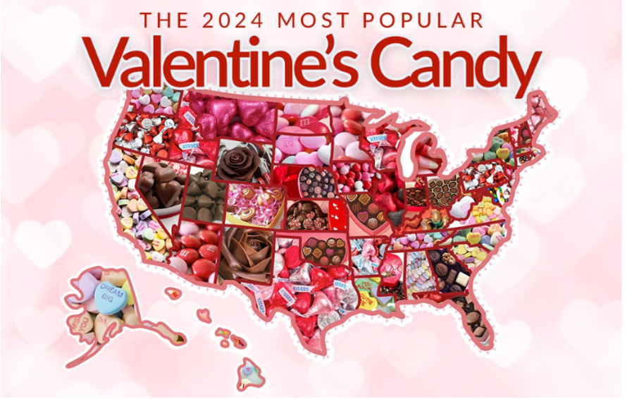

# Critique - Valentine's Day Candy Map

## For this graphic, what do you see first?
When I first look at this graphic, the pink and red colors stand out the most and give me an instant Valentine’s Day feeling. My eyes are also drawn to the big title “Valentine’s Candy,” which is so large that it feels stronger than the actual map itself. After that, I notice that each state is filled with candy pictures, but there are no numbers showing  in this map. 

## Make a note of the first idea that forms in your mind and then search for more.  
The first idea that comes to mind is that this graphic is festive and fun, which matches the Valentine’s vibe, but it does not communicate much information clearly. As I spend more time looking, I realize it is supposed to show the most popular Valentine’s candy in each state. However, the candy pictures are crowded and there are no labels, so it is hard to tell which state has which candy without guessing. I also notice there is no explanation of what “most popular” means—whether it is sales, surveys, or something else. This makes me question how reliable the data is. Overall, the graphic looks attractive, but as a data visualization it feels more decorative than informative.
